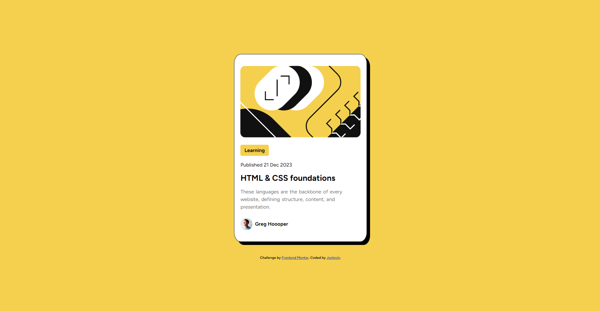

# Frontend Mentor - Blog preview card solution

This is a solution to the [Blog preview card challenge on Frontend Mentor](https://www.frontendmentor.io/challenges/blog-preview-card-ckPaj01IcS). Frontend Mentor challenges help you improve your coding skills by building realistic projects. 

## Table of contents

- [Overview](#overview)
  - [The challenge](#the-challenge)
  - [Screenshot](#screenshot)
  - [Link](#link)
  - [Built with](#built-with)
  - [What I learned](#what-i-learned)
- [Author](#author)

## Overview

### The challenge

Users should be able to:

- See hover and focus states for all interactive elements on the page

### Screenshot

### Link

- Solution URL: [Add solution URL here](junlovin.github.io/Blog-Preview)

### Built with

- CSS custom properties
- Flexbox
- CSS Grid

### What I learned

I learned more about grid and their functionalities

## Author

- Website - [JunLovin](https://junlovin.github.io/Mathias)
- Frontend Mentor - [@JunLovin](https://www.frontendmentor.io/profile/JunLovin)
- Twitter - [@junlovin23](https://www.twitter.com/junlovin23)